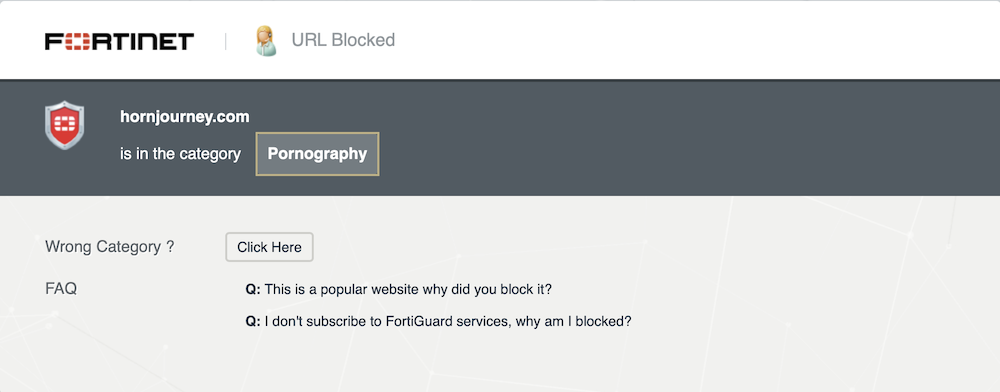

I’d like to stray slightly from the topic of learning horn, and instead talk about the unexpected pitfalls of choosing a horn-related domain name. Beware: this is going to get into some geeky website details. The punch line is kind of funny, though, even if you ignore the details.

I launched this website, hornjourney.com, at the beginning of June, just before the opening week of this year’s Kendall Betts Horn Camp. At the camp location, the White Mountain School in Bethlehem, New Hampshire, we had ready access to a decent guest WiFi network, which was an improvement over the previous camp location. I was frustrated to discover, however, that I could not access hornjourney.com over the WiFi network. I kept getting errors in Safari (the Mac web browser) about an insecure website. I wasn’t able to figure out why this was happening before camp ended, and so I decided to leave it as an unsolved mystery.

Until.

On a cruise ship vacation this month, I found myself once again unable to access hornjourney.com over a WiFi network. So, during down times on the cruise, I began digging deeper into the problem.

Initially, I used online searches combining the name of my web hosting company (Netlify) and the browser error messages. I found some support forum threads that seemed related, but I failed to find a definitive explanation or an effective solution.

Next, I tried switching browsers. Chrome also showed a security error message, but it also included a puzzling notification that an app called “Fortinet” was causing the problem. I had never heard of that app. I searched my computer and found no such app.

More online searching taught me that Fortinet provides firewall security and content filtering services for company and institutional networks, including WiFi networks. Another forum thread helped me to discover that my website’s HTTPS certificate (I warned you that this was going to get geeky) was showing up as signed by Fortinet instead of the actual certificate provider, Let’s Encrypt. For some reason, Fortinet was intercepting my HTTPS certificate, re-signing it, and labeling it as untrusted.

!!!

Another round of online searches followed, this time with the keywords “Fortinet” and “Let’s Encrypt.” Another discussion thread popped up, this time on a Let’s Encrypt support forum. Someone posted that Fortinet’s software categorizes all websites. Apparently, this automatic categorization is based on the domain name.

Uh oh. (Do you see where this is going yet?)

Fortunately, Fortinet has an online tool that lets you check how any website has been categorized. Here’s what the tool told me:



There it is. That’s why my site was being filtered on the cruise ship’s WiFi network. Fortinet had decided that my website was about pornography. I assume this was solely because of the word "horn" in the domain name. I also assume this was the reason for the problem during horn camp.

The “Click Here” button next to “Wrong Category ?” gave me hope. It took me to a form where I was able to post a screen shot of this site and explain that, well, this is not a porno site.

An hour later, I received an emailed response:

```
Dear Fortinet customer,

The website(s) you submitted below has been reviewed and updated:

Submission Date:            Wed, 12 Jul 2023 08:28:48 -0700
URL:                        hxxp://hornjourney[.]com/
Customer Comment:           hornjourney.com is related to French horn, the musical instrument, not pornography.
Updated Category:           Arts and Culture
Update Date:                Wed, 12 Jul 2023 09:49:52 -0700
```

About thirty minutes after that, I was able to access hornjourney.com on the ship.

Phew!

What a pain.

